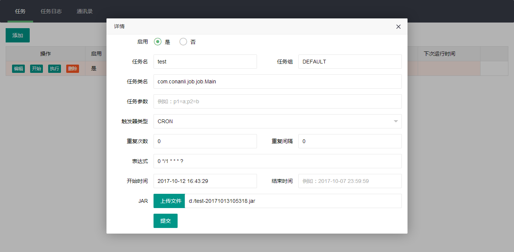
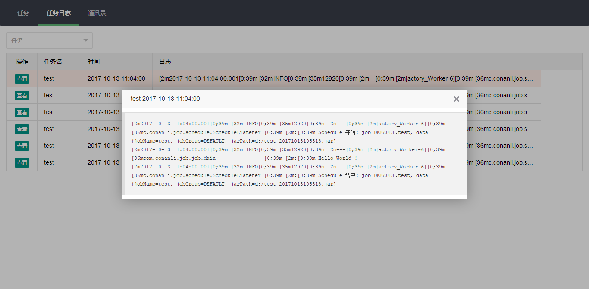
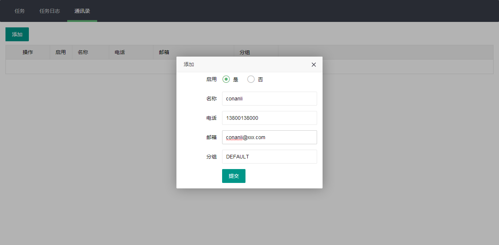

# Job 定时任务

- 上传 Jar 包，通过 Quartz 定时执行
- Jar 包支持 SpringBoot特性
- 独立日志、异常邮件通知
- 一个任务一个类加载器，独立的 IoC 上下文

## 任务 `http://localhost:9898/job.html`



触发器类型为`SIMPLE` 时，参数`重复次数`、`执行间隔`有效

触发器类型为`CRON`时，参数`表达式`有效

- 【开始】 根据设置的触发器定时执行
- 【停止】 关闭定时任务
- 【执行】 马上执行一次

## 任务日志 `http://localhost:9898/joblog.html`



## 通讯录 `http://localhost:9898/contact.html`



任务的`任务组`与通讯录的`分组`对应，当执行的 Jar 包抛出异常，就会发送异常信息到相应的邮箱

## Jar 包

job-example 目录下有一些例子供大家参考，以下是 job-example-java-simple 的例子

添加依赖：

```xml
<!-- 方便 Jar 包的测试 -->
<dependency>
    <groupId>com.conanli.job</groupId>
    <artifactId>job-test</artifactId>
    <scope>test</scope>
</dependency>

<dependency>
    <groupId>org.slf4j</groupId>
    <artifactId>slf4j-log4j12</artifactId>
</dependency>

<dependency>
    <groupId>org.quartz-scheduler</groupId>
    <artifactId>quartz</artifactId>
</dependency>
```

打印`Hello World !`

```java
package com.conanli.job.job;

import org.quartz.Job;
import org.quartz.JobExecutionContext;
import org.quartz.JobExecutionException;
import org.slf4j.Logger;
import org.slf4j.LoggerFactory;

public class Main implements Job {

    Logger logger = LoggerFactory.getLogger(getClass());

    @Override
    public void execute(JobExecutionContext context) throws JobExecutionException {
        logger.info("Hello World !");
    }
}
```

Jar 包放入`job-api`工程中运行，共享它的类依赖，因此我在打包时，使用了`maven-assembly-plugin`，把重复的依赖去掉，减少 Jar 包的大小